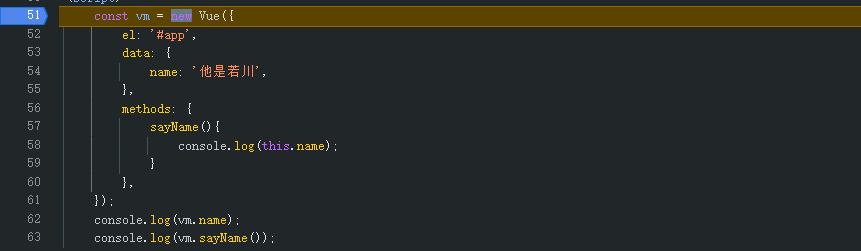
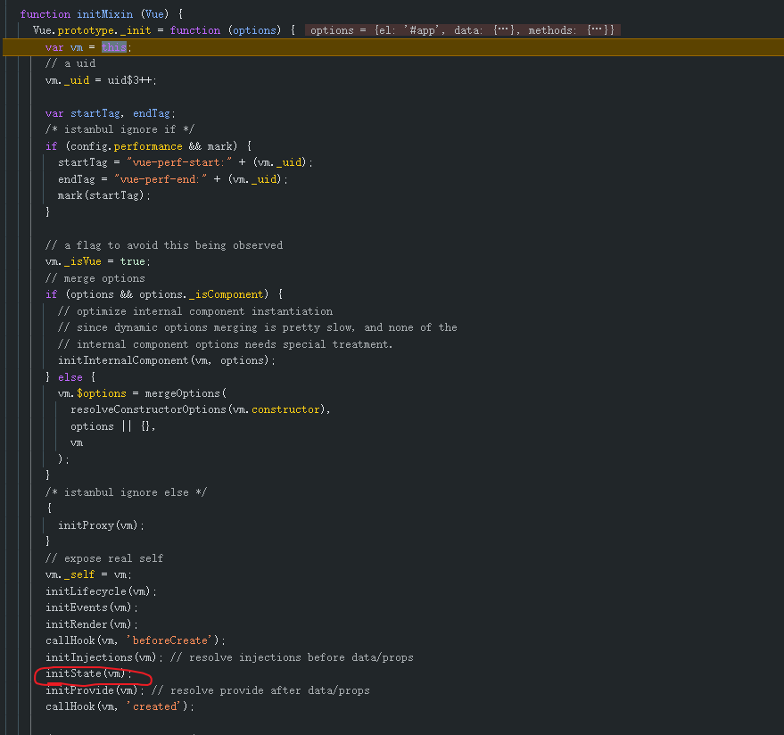
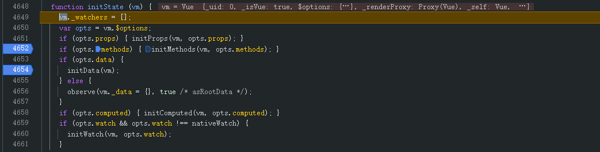
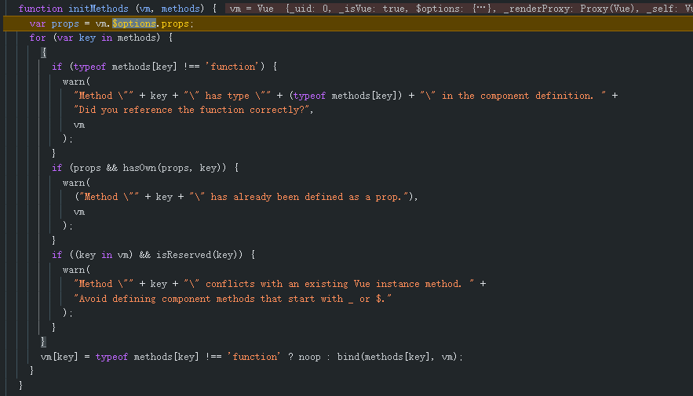
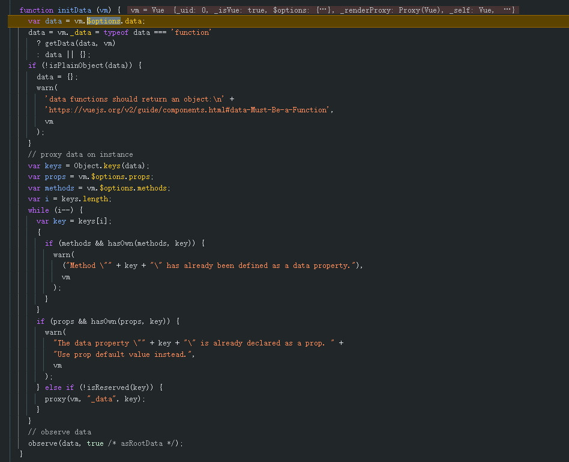

## vue是如何实现this能够访问data或者props和methods内的属性值的?

## 学习目标
```
1. 如何学习调试 vue2 源码
2. data 中的数据为什么可以用 this 直接获取到
3. methods 中的方法为什么可以用 this 直接获取到
4. 学习源码中优秀代码和思想，投入到自己的项目中
```

## 学习调试 vue2 源码
```html
<script src="https://unpkg.com/vue@2.6.14/dist/vue.js"></script>
通过引入unpkg的vue.js文件，可以调试vue2的源码(长知识了，以前都是使用打包后的文件，没想到还有提供unpkg的形式，十分方便调试查看源码)
```

## 调试过程
我们从初始化vue实例中一步一步调试，看看具体是如何实现的。

然后会看到有个```initState```方法，这个就是我们要研究的重点。

再进去一看，发现这里进行了```initData```和```initMethods```,那我们来看看```initMethods```里做了什么

可以看到这里出现了三个if判断，分别是判断是否为methods里面的值为函数，命名是否已经在pros中存在，以及是否占用了vue内部的属性名

而核心的部分就是最后一行代码，我们可以看到这里将methods里面的值直接赋给了vue实例对象，也就是this指向。noop就是一个占位符，用于表示空函数，bind就是Function.bind方法,将函数内部的this指向变成vue实例对象。
然后我们再来看看```initData```做了什么

除去一些判断操作，我们来看核心部分,这里使用了一个proxy代理。
看到这里，我就产生了一个问题，为什么我们不能直接照着```initMethods```那样，直接将```data```里面的值赋给vue实例对象呢？
```js
    var data = vm.$options.data;
 // proxy data on instance
    var keys = Object.keys(data);
    var i = keys.length;
    while (i--) {
      var key = keys[i];
        proxy(vm, "_data", key);
    }
    // observe data
    observe(data, true /* asRootData */);
```
于是我就写了下述demo,vue2是通过对data进行```Object.defineProperty```来实现双向绑定，但如果直接就是在这里使用```this[key] = 'xxx'```，那么就会循环调用。所以我们需要额外加一层。通过操作```_data```来访问data的值进行双向绑定
```js
 function noop (a, b, c) {}
 var sharedPropertyDefinition = {
    enumerable: true,
    configurable: true,
    get: noop,
    set: noop
  };
  function proxy (target, key) {
    sharedPropertyDefinition.set = function proxySetter (val) {
      this[key] = val;
    //   ...将使用这个数据的渲染视图，都进行重新渲染
    };
    Object.defineProperty(target, key, sharedPropertyDefinition);
  }
  function Person(data){
    const keys = Object.keys(data);
    keys.forEach((key)=>{
      this[key] = data[key];
      proxy(this,key);
    })
  }
  const data ={
    name:'小米',
    age:20
  }
  const p1 = new Person(data);
  console.log(p1)
```
用数据流的话可以这样理解
当然可以使用ES6新特性中的```Proxy```来实现，```Proxy```中提供了一个```Reflect```，可以避免递归调用。这也就是为什么Vue3中采用```proxy```的原因。
但也可以用闭包的形式来解决。
```js
 function proxy (target, key) {
    let value = target[key];
    sharedPropertyDefinition.get = function proxyGetter () {
      return value
    };
    sharedPropertyDefinition.set = function proxySetter (val) {
      value = val;
    };
    Object.defineProperty(target, key, sharedPropertyDefinition);
  }
```